# CS 601 Project Final Report

**Team** 4

**Members** Yeh-Tarn Su (nw2623), Krish Vora (vq4609)

**Web Page** http://csweb01.csueastbay.edu/~nw2623/cs601/project/

**Videos**

- [Presantation Video](https://youtu.be/3kml9Fii7Ws)
- [Application Demonstration](https://youtu.be/5_CmIe3Xh5w)

## Project Description

In this project, we have implemented a few finding algorithms using certain variations namely linear and randomized median finding algorithms.

The user is able to select the “k”, i.e., the rank of the number desired as output while using our web application.

The user is also able to select groups of 3, 5, 7 etc in the linear-time median finding algorithm and be able to compare the performance of each. We have implement both randomized and linear finding median finding algorithms and also compared their performance.

We have further implemented quick sort using both algorithms and compared the performances of these different versions.

## List of Completion and Design Layers

### Algorithms

1. Linear-Time median finding algorithm (Group Amount of 3, 5, 7)
2. Randomized median finding algorithm
3. Quick Sorting (based on the previous two algorithms)

### APIs

1. AWS Lambda Function for median finding algorithm
2. AWS Lambda Function for quick sorting
3. AWS API Gateway for routing the Lambda Functions

### Web UI

- A single-page-application integrated with the API.

The high target and a part of the extra target was completed. All of the desirable functionalities, including three algorithms, the API, and the web UI, were finished. Moreover, extra efforts for improving the UI. The following diagram describes the architecture of this project.

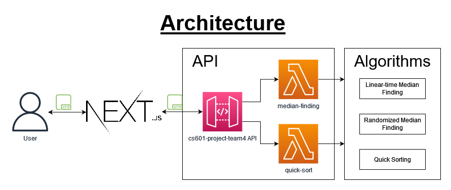

## Application Demonstration

The user is able to interact with our project using the web application that we have created. The web application is hosted on our csweb01 servers. The link of the web page is provided at the begining of this report.

- The user can select the algorithm and the parameters they wish to use. They also need to provide the input data such as Input Sequence length and Target Number. The web application then sends the input data to an API which processes the raw data and returns the necessary information regarding the algorithm.
- The user can select multiple modes (linear group amount of 3, linear group amount of 5, randomized…etc) and will be able to see the information about the result of applying the algorithm and the comparison between different configurations.

The following screenshots demonstrate the user interaction.

### Median Finding Algorithm

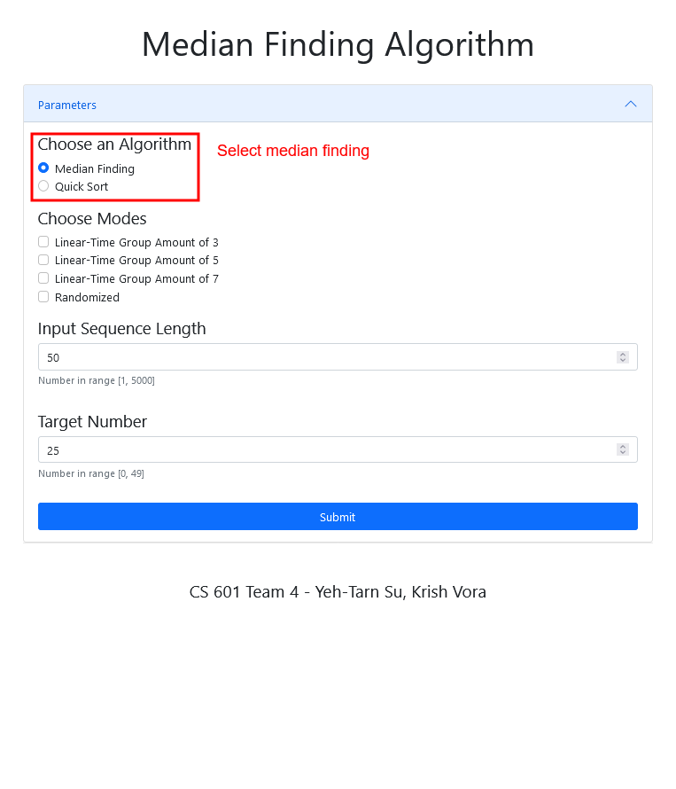

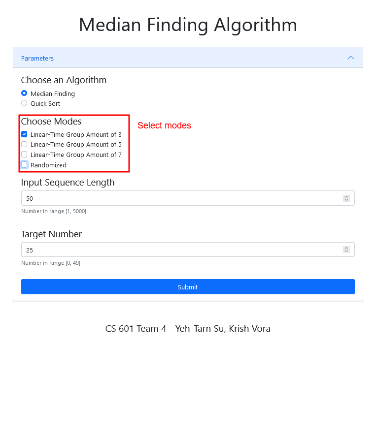

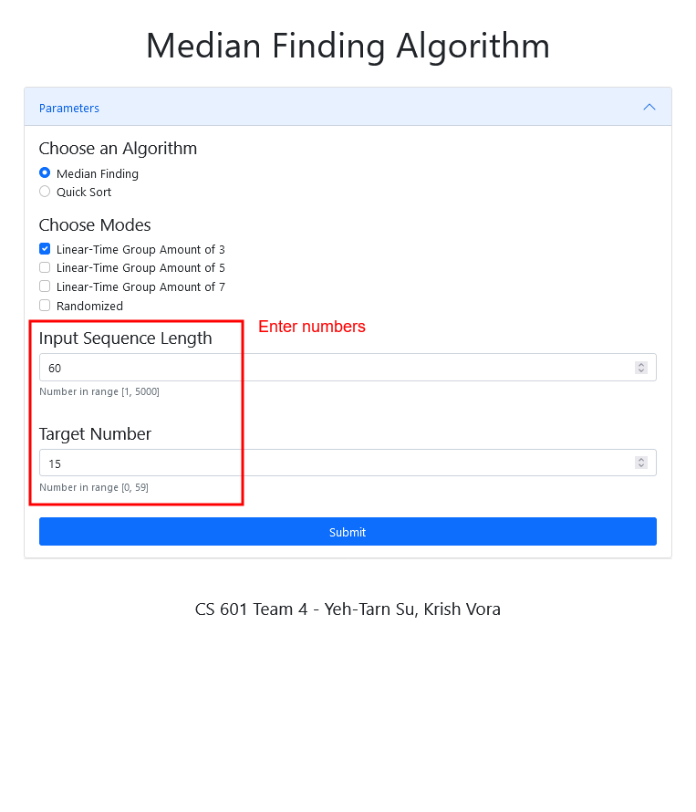

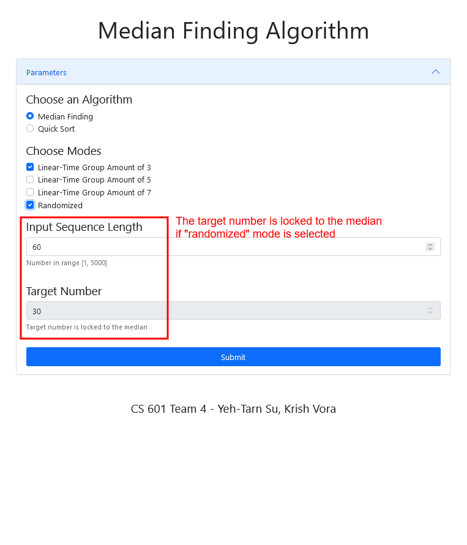

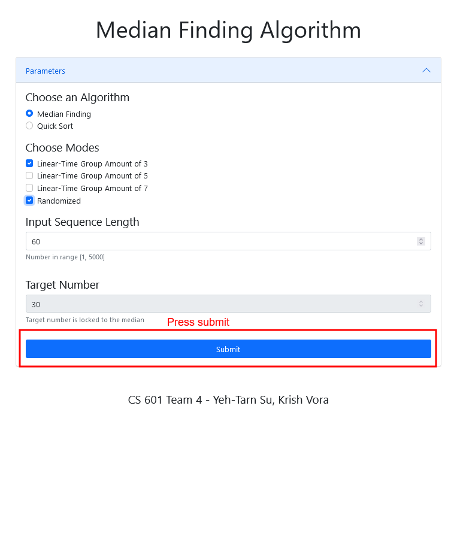

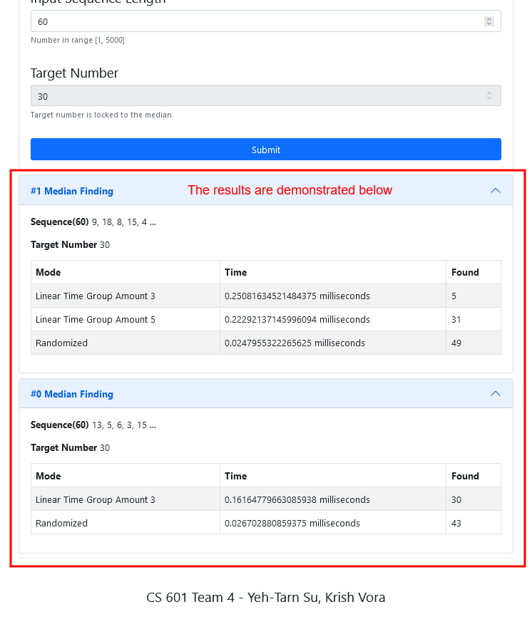

### Quick Sort

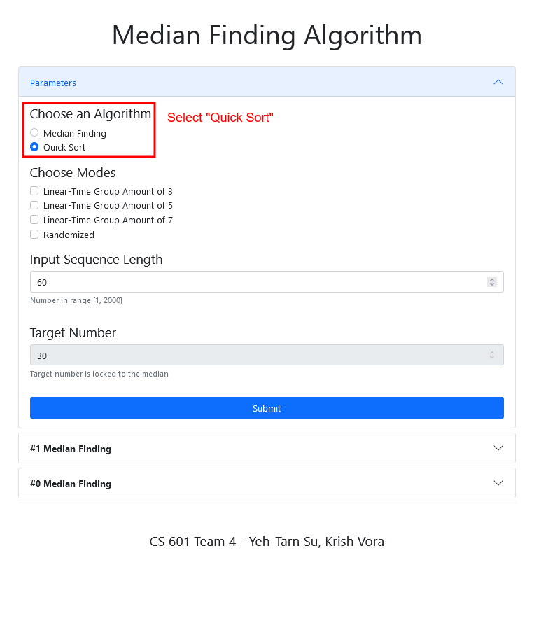

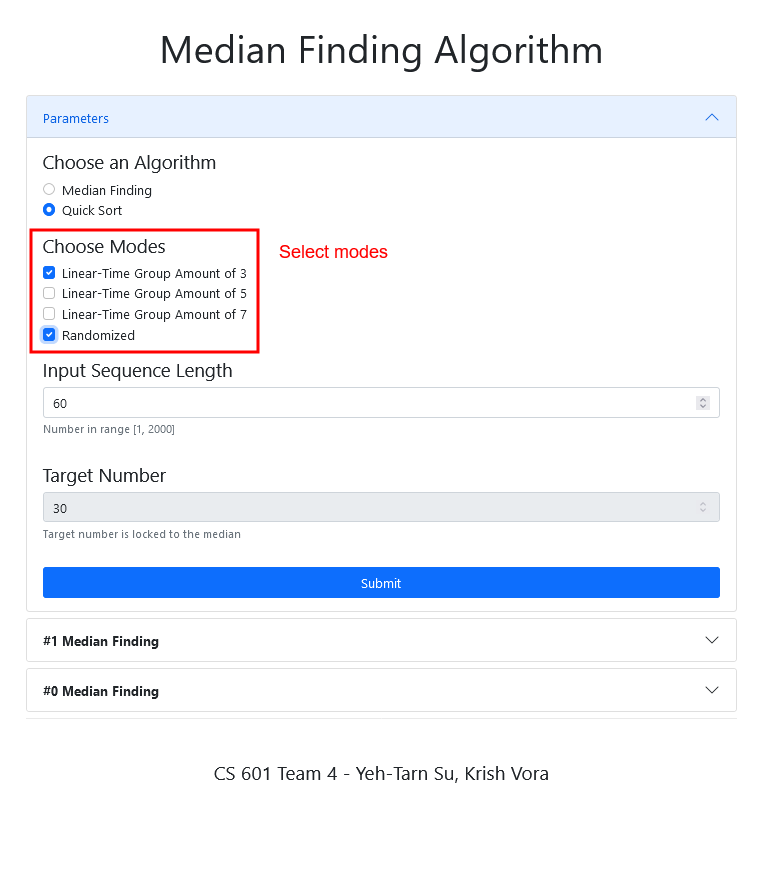

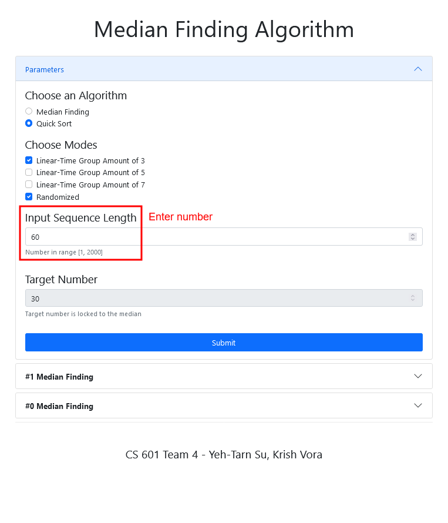

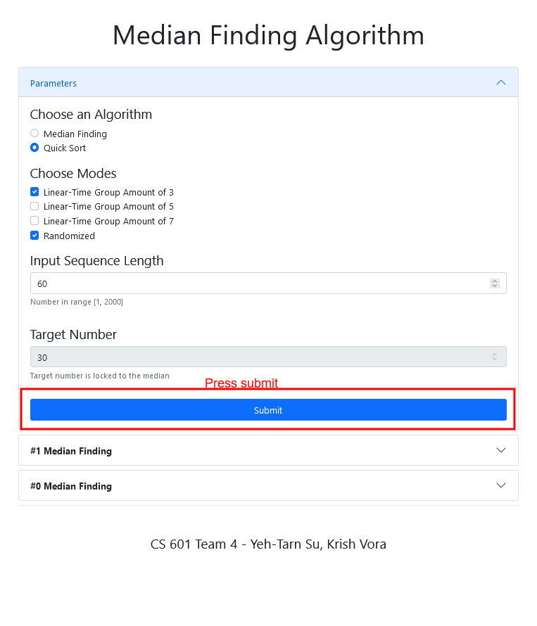

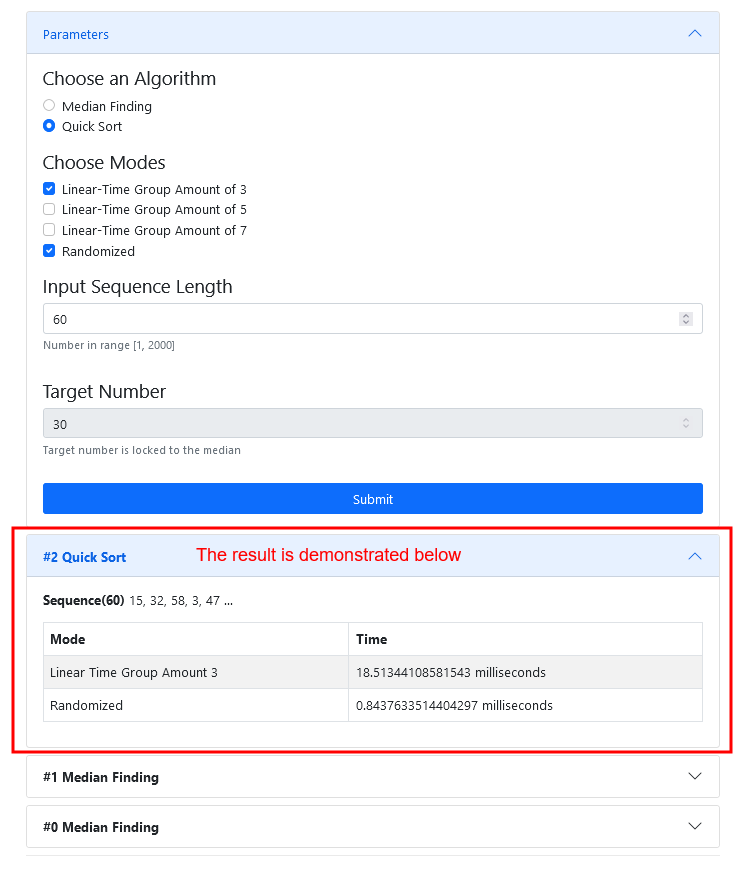

## Development Details

### Algorithm Implementations

#### Linear-Time Median Finding Algorithm

For our first algorithm, we implemented a linear time median finding algorithm which is an approximate (median) selection algorithm. This algorithm is frequently used to supply a good pivot for an exact selection algorithm, mainly the quick-select, that selects the kth smallest element of an initially unsorted array.

Our Algorithm finds an approximate median in linear time only, which is limited but an additional overhead for quick-select. When this approximate median is used as an improved pivot, the worst-case complexity of quick-select reduces significantly from quadratic to linear, which is also the asymptotically optimal worst-case complexity of any selection algorithm. In other words, the median of medians is an approximate median-selection algorithm that helps building an asymptotically optimal, exact general selection algorithm (especially in the sense of worst-case complexity), by producing good pivot elements.

#### Randomized Median Finding Algorithm

We implemented a probabilistic approach that selects a pivot p an element selected uniformly at random among all elements in the list. In the worst-case, our algorithm may be unlucky at every step and perform roughly cn^2 comparisons, but that is an extremely rare situation. Our algorithm, on average, performs at most cn comparisons for some appropriate constant.

If we selected an arbitrary element for p, we might be unlucky and be able to discard very few elements; in the worst-case, this may lead to cn^2 comparisons for some c. By carefully selecting a good candidate as pivot element, one can devise a rank m selection algorithm that makes at most cn comparisons in the worst-case. But since this is a pretty complicated algorithm and analysis, and instead, we have used a simple probabilistic approach in our algorithm to determine the median.

#### Quicksort

We implemented Quicksort which is an in-place sorting algorithm. Quicksort is a divide-and-conquer algorithm. It works by selecting a 'pivot' element from the array and partitioning the other elements into two sub-arrays, according to whether they are less than or greater than the pivot. For this reason, it is sometimes called partition-exchange sort. The sub-arrays are then sorted recursively. This can be done in-place, requiring small additional amounts of memory to perform the sorting.

### Programming Languages

#### ReactJS (Front End)

We used ReactJS to create the front end of our web application. Our ReactJS web application is made up of multiple components, and each component has its own logic and controls. These components are responsible for outputting a small, reusable piece of HTML code which can be reused wherever you need them. The reusable code helps to make our app easier to develop and maintain. These components can be nested with other components to allow complex applications to be built of simple building blocks.

ReactJS uses virtual DOM based mechanism to fill data in HTML DOM. The virtual DOM works fast as it only changes individual DOM elements instead of reloading complete DOM every time.

ReactJS improves performance due to virtual DOM. The React Virtual DOM exists entirely in memory and is a representation of the web browser's DOM. Due to this, when we write a React component, we did not write directly to the DOM. Instead, we are writing virtual components that react will turn into the DOM, leading to smoother and faster performance.

#### Python (Server-Side)

We used Python for our server side code since it is open source and provides developers with support from a large developer community. The standard library contains scripts for many widely used programming tasks which significantly reduce the length of code and execution time.

We made use of python’s own unit testing framework. Python also aids in robust, flexible scalable and high-quality responsive web development that offer a streamlined experience to users.

### Framework

#### Next.js

We use Next.js as a framework for our application which is an integral part of the React ecosystem. It was developed specifically to address the SSR challenge for React applications.

React components that make up the user-facing part of a website are all initially rendered on the server side. This means that once the HTML has been delivered to the client (the user’s browser), nothing else needs to happen for the user to be able to read the content on the page. This makes page loading times appear much faster to the user.

SSR also gives the benefit of an out-of-the-box, indexable and crawlable website, which is essential for Search Engine Optimization (SEO) as the client side javascript does not need to be executed to see the page content. Essentially, our clients benefit from improved technical SEO.

## API Implementation

We created a Web API using Amazon Web Services for sending our parameters to the server and computing the median for the requested sequence. Our API makes use to AWS Lambda and API Gateway for the computation and hosting functionality.

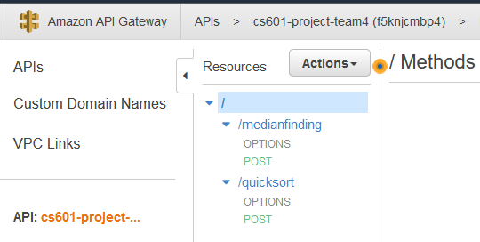

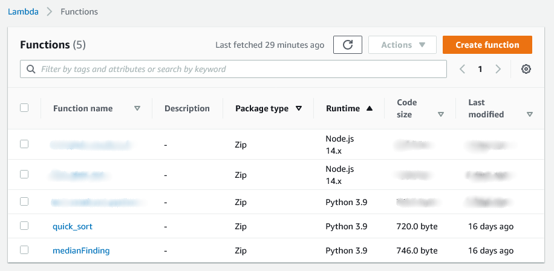

## Web Application Deployment

We deployed the front page of our web application on the CSUEB Web Systems CS servers that are provided to us.

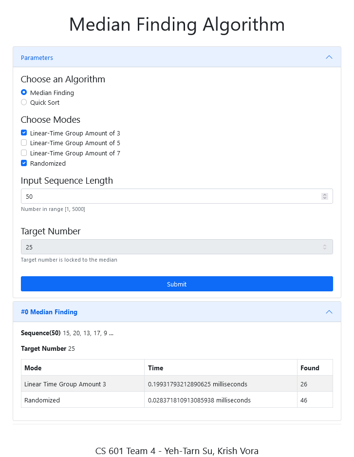

## Testing

### Code Reviews and AWS Testing Tools

We performed code reviews via Github to check and review new code functionality and used the testing tools provided via AWS to debug our API for functional and logical errors.

### Lambda Test

We performed UI testing using Lambda Test. Lambda Test is a chrome extension which provides Live Interactive and Automated Cross Browser Testing on 2000+ Real Browsers and Operating Systems.

### Unit Test

We made use of unit tests in python to test our median finding algorithms.

- Algorithms
  - Linear-Time Median Finding Algorithm
    - Code Correctness
    - Accuracy
  - Randomized Median Finding Algorithm
    - Code correctness
    - Accuracy
  - Quick Sort
    - Code correctness
- Lambda Function Handlers
  - Median Finding Algorithms
    - Correctness of HTTP Response
  - Quick Sort
    - Correctness of HTTP Response

## Revisions

### Simplify the API Architecture

In the phase 2, multiple AWS lambda functions are deployed. For each mode of algorithm, linear-time median finding algorithm in different group amount, randomized median finding algorithm, quick sorting based on different algorithms, a AWS Lambda Functions was planned to be deployed. As a result, 6 AWS Lambda functions in total that some of them might be redundant.

After reviewing the design of application, the total number of AWS Lambda Function is reduce to 2. The functionality of the application can be divided into two parts, which are the median finding algorithm and the quick sorting. Merging the input form, extending the payload, and checking more conditions in a single AWS Lambda Function, less number of AWS Lambda Functions is able to provide the same amount of functionalities.

### Apply a Web Application Framework

In the phase 2, the web UI is implemented by a simple combination of HTML and JavaScript. Simplicity is the main idea since there are only a few expected functionalities, a complicate technique is not necessary. For the same reason, the design of single-page-application is also targeted in order to make the web UI looks simple. This design allows the web UI runs without a server.

However, there is conflict between simplicity and single-page-application. The effects on HTML elements are complicated to implement and hard for revision and refinement as the code becomes hard to manage.

After researching on some web application framework, Next.JS is applied for this project. Using React components greatly improve the implementation of single-page-application. Moreover, static exportation keeps the web UI standing without server.

## Learning and Outcome

While working on developing our median finding project, we were faced with a few obstacles that we had to overcome in order to get our project to fruition.

Trying to implement an API using AWS and getting the server side functionality was a task we had never done before. We were working in a constricted time frame and AWS required a high learning curve before we could implement our API.

We had to spend considerable time figuring out the internal workings of AWS and how our API would interact with our application. After implementing the API we were left with the task of testing the API with various end to end cases to ensure that it wouldn’t fail under diverse interaction scenarios.

At the end however, we were able to successfully implement the functionality that we set out out to fulfill. We look forward towards completing the project and showcasing an exemplary project.

## Contributions

### Yeh-Tarn Su

- Algorithms
  - Linear-time median finding algorithm
  - Randomized median finding algorithm
- Unit tests
  - Linear-time median finding algorithm
  - Randomized median finding algorithm
- API
  - AWS Lambda Functions
    - Linear-time median finding algorithm
    - Randomized median finding algorithm
    - Comparing between linear-time median finding algorithm
  - AWS API Gateway
- Web UI
- Monitor and manage the progress of the project

### Krish Vora

- Algorithms
  - Randomized median finding algorithm
  - Quick sort (regular version)
- Lambda Tests
- Documentations
  - Report slides
  - Presentation Videos
